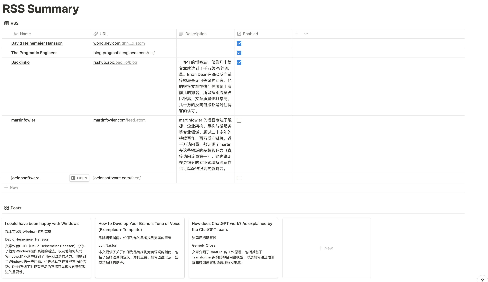

# Notion Summary
这是一个使用Kimi AI定时总结Notion中RSS订阅链接文章的Notion Integration工具。

## 简介
通过这个集成，用户可以轻松地在Notion页面上获取和总结他们关注的RSS订阅源中的文章，总结后的结果将会写入到对应Notion页面中，你可以通过总结判断是否去阅读原文。



## 功能
- **定时更新**：根据设定的时间间隔（默认是1小时）自动更新订阅源。
- **AI摘要**：利用Kimi AI技术生成文章总结。
- **集成Notion**：直接在Notion页面上展示总结。

## 配置与启动
前置准备：
1. **拷贝Notion模板**：
    - 将这个Notion[模板](https://lydian-jelly-d27.notion.site/RSS-Summary-d5d03d21d7204fdca41cb34e1b9d24ab?pvs=4)复制到你的notion中
    - 获取模板中两个database的id（在每个database的New旁边有三个点，点击后便可以看到"Copy link to view"，即可看到database的id）
2. **创建与安装notion Integration**：
   - 到Notion的Integration管理页面，创建一个[Integration](https://www.notion.so/my-integrations)，创建后notion会为你分配一个Secret Key。
   - 进入你的notion，到刚才复制的模板中，点击右上角的“...”，在**Connect to**那里添加刚才你创建的Integration。
3. **创建Kimi API Key**：
   - 登录Kimi AI的[开放平台](https://platform.moonshot.cn/)，创建API key。

环境变量配置：
1. 打开你的shell profile，如果你和我一样使用的是zsh，那就是`~/.zshrc`
2. 配置以下环境变量:
   ```
   export NOTION_API_KEY=${填入你的notion Ingetration secret key}
   export NOTION_RSS_DATABASE_ID=${填入模板中第一个database的id}
   export NOTION_POST_DATABASE_ID=${填入模板中第二个database的id}
   export MOONSHOT_API_KEY=${填入你的kimi api key}
   ```

配置RSS订阅源
1. 到模板中添加你关注的RSS订阅源

项目运行：
1. **clone项目**：将项目clone到你的机器上
2. **安装依赖**：运行go mod download
3. **运行**：go run main.go

## 全部环境变量
| 环境变量名 | 含义 | 是否必填 | 默认值 |
|-------|-------|-------|----------------|
| NOTION_API_KEY |  notion的Integration api key | 是 | - |
| NOTION_RSS_DATABASE_ID |  notion模板中RSS database id | 是 | - |
| NOTION_POST_DATABASE_ID | notion模板Post database id | 是 | - |
| MOONSHOT_API_KEY |  kimi的secret key | 是 | - |
| KIMI_MODEL |  kimi的采用的模型 | 否 | moonshot-v1-32k |
| SUBSCRIPTION_SYNC_INTERVAL |  定时拉取的间隔，配置参考[cron](https://github.com/robfig/cron) | 否 | @every 1h |
| PORT |  服务启动端口 | 否 | 8080 |


